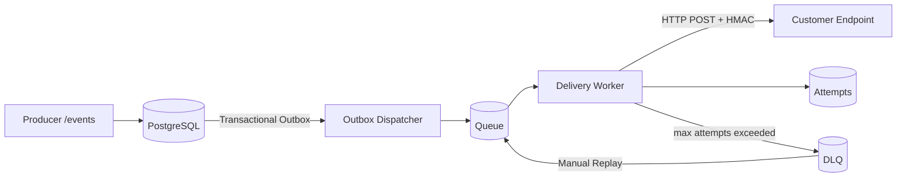

# 🚀 Webhook Delivery Platform (Outbound Webhooks)

**Production-grade, multi-tenant webhook delivery** with **Transactional Outbox**, **retry (backoff + jitter)**, **DLQ + replay**, **HMAC signing**, and **observability**, backed by **Dev Portal (React)** + **Ops Console (Angular)**.

**Developed by Filipi Wanderley.**

---

## 🏷️ Tech Stack (with versions)


---

## 🎯 Why this exists (real production problem)

Outbound webhooks are deceptively simple until production:
- ⚠️ Customer endpoints are unstable (**timeouts / 5xx / 429**) → retry storms 
- 🔁 Retries can create **duplicates** → side effects & data corruption 
- 🧯 Without **DLQ + replay**, ops can’t recover safely 
- 🔎 Without metrics/tracing, incidents become guesswork 
- 🧱 Without isolation/limits, one noisy endpoint degrades the whole platform 

This repo implements reliability patterns commonly used in real SaaS webhook systems.

---

## ✅ Key features

### Reliability
- 🧾 **Transactional Outbox** for durable event recording
- 🔁 **Retry policy**: exponential backoff + jitter (classified by failure type)
- 🧯 **DLQ + replay** for safe recovery and auditability
- 🧷 **Dedupe guard** per `(endpoint_id, event_id)` (**at-least-once** semantics)
- 🧱 **Concurrency limits / endpoint protection** (prevents saturation)

### Security
- 🔐 **HMAC-SHA256 signing** per endpoint secret
- 🧷 Standard headers: `X-Webhook-Id`, `X-Webhook-Timestamp`, `X-Webhook-Signature`

### Operations & Observability
- 📜 Attempts history (status, latency, partial response)
- 📈 Metrics + tracing for incident response
- 🖥️ Two UIs:
  - **Dev Portal (React + MUI DataGrid)**: endpoints, deliveries, replay, test events
  - **Ops Console (Angular + Material)**: DLQ triage, replay, endpoint control, dashboards

---

## 🧠 Architecture Overview

### Delivery Flow


Fallback diagram (if Mermaid is not rendered) 
 Producer -> /events -> Postgres(outbox) -> Dispatcher -> Queue -> Worker -> Customer Endpoint 
                                            |                          | 
                                            v                          v 
                                         Attempts                      DLQ -> Replay -> Queue 

### Delivery semantics (explicit)

✅ **At-least-once delivery**: an event may be delivered more than once in failure scenarios.

🧷 **Dedupe guard** prevents multiple successful deliveries for the same `(endpoint_id, event_id)`.

📌 **Consumers should still implement idempotency.**

---

## 🗂️ Repository structure

```
. 
├─ backend/                          # Spring Boot backend (hexagonal-ish) 
│  ├─ src/main/java/.../domain       # core domain 
│  ├─ src/main/java/.../application  # use-cases, ports 
│  ├─ src/main/java/.../adapters     # web + persistence + messaging adapters 
│  ├─ src/main/java/.../infra        # config, schedulers, observability 
│  └─ src/main/resources/ 
│     ├─ db/migration                # Flyway migrations 
│     └─ application-*.properties 
├─ frontend-react/                   # Dev Portal (React + MUI + DataGrid) 
│  ├─ src/app                        # providers, routing, app shell 
│  ├─ src/features                   # feature modules (endpoints, deliveries) 
│  ├─ src/ui                         # shared UI kit + DataGrid wrapper 
│  ├─ src/lib                        # api client, utils 
│  └─ src/styles                     # theme/tokens 
├─ frontend-angular/                 # Ops Console (Angular + Material) 
│  ├─ src/app/core                   # auth, interceptors, guards, api 
│  ├─ src/app/shared                 # shared UI components 
│  └─ src/app/features               # dlq, controls, dashboard 
├─ infra/                            # docker-compose & local infra 
└─ docs/                             # architecture notes + repo summaries 
```

---

## ⚙️ Getting Started (Local)

### Prerequisites

🐳 **Docker + Docker Compose**

☕ **Java 17+**

🟢 **Node 20+**

### 1) Start infrastructure
```bash
cd infra
docker compose up -d
```

### 2) Run backend
```bash
cd backend
./mvnw spring-boot:run
```

### 3) Run Dev Portal (React)
```bash
cd frontend-react
npm ci
npm run dev
```

### 4) Run Ops Console (Angular)
```bash
cd frontend-angular
npm ci
npm start
```

### Local URLs / Ports

- **Backend**: http://localhost:8080
- **Dev Portal**: http://localhost:5173
- **Ops Console**: http://localhost:4200

---

## 🔌 Webhook contract (HMAC)

### Headers

- `X-Webhook-Id`: event id
- `X-Webhook-Timestamp`: unix timestamp (seconds)
- `X-Webhook-Signature`: HMAC-SHA256

### Signing input

`timestamp + "." + rawBody`

---

## 🔁 Retry policy (high level)

> Adjust to match your implemented policy.

- ⏱️ **Timeout / network / 5xx** → retry
- 🚦 **429** → retry (backoff; optional Retry-After)
- 🧱 **404/410** → fail (no retry by default)
- ⚠️ **other 4xx** → configurable (default: no retry)

### Backoff:

- **exponential + jitter**
- max attempts per endpoint
- delay cap

---

## 🧪 Testing

### Backend:
```bash
cd backend
./mvnw test
```

### React:
```bash
cd frontend-react
npm run lint --if-present
npm run test --if-present
npm run build
```

### Angular:
```bash
cd frontend-angular
npm run lint --if-present
npm run test --if-present
npm run build
```

---

## 📈 Observability

- **Structured logs** with correlation/trace context (when enabled)
- **Metrics**: success/failure, retries, DLQ size, latency histograms
- **Tracing**: ingest → outbox → enqueue → attempt → outcome

---

## 🖼️ Screenshots

Add screenshots to `docs/screenshots/` (optional):

- `dev-portal-endpoints.png`
- `dev-portal-delivery-detail.png`
- `ops-dlq-list.png`
- `ops-dlq-detail.png`
- `ops-dashboard.png`

---

## 🧭 Roadmap

- [ ] Per-tenant rate limiting & quotas
- [ ] Secret rotation UX + signature versioning
- [ ] Failure analytics (clustering by reason/status)
- [ ] Worker scaling strategy (partitioning / ordering where applicable)
- [ ] Integration contract test kit
