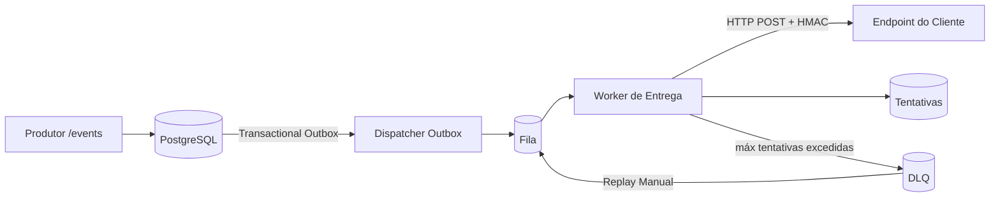

# 🚀 Plataforma de Entrega de Webhooks (Outbound)

**Entrega de webhooks multi-tenant de nível de produção** com **Transactional Outbox**, **retry (backoff + jitter)**, **DLQ + replay**, **assinatura HMAC** e **observabilidade**, suportada por **Dev Portal (React)** + **Ops Console (Angular)**.

**Desenvolvido por Filipi Wanderley.**

---

## 🏷️ Tech Stack (com versões)


---

## 🎯 Por que isso existe (problema real de produção)

Webhooks de saída parecem simples até chegarem em produção:
- ⚠️ Endpoints de clientes são instáveis (**timeouts / 5xx / 429**) → tempestades de retentativas (retry storms)
- 🔁 Retentativas podem criar **duplicatas** → efeitos colaterais e corrupção de dados
- 🧯 Sem **DLQ + replay**, a operação não consegue se recuperar com segurança
- 🔎 Sem métricas/rastreamento, incidentes viram adivinhação
- 🧱 Sem isolamento/limites, um endpoint barulhento degrada toda a plataforma

Este repositório implementa padrões de confiabilidade comumente usados em sistemas de webhook SaaS reais.

---

## ✅ Principais funcionalidades

### Confiabilidade
- 🧾 **Transactional Outbox** para registro durável de eventos
- 🔁 **Política de Retry**: backoff exponencial + jitter (classificado por tipo de falha)
- 🧯 **DLQ + replay** para recuperação segura e auditabilidade
- 🧷 **Dedupe guard** por `(endpoint_id, event_id)` (semântica **at-least-once**)
- 🧱 **Limites de concorrência / proteção de endpoint** (evita saturação)

### Segurança
- 🔐 **Assinatura HMAC-SHA256** por segredo de endpoint
- 🧷 Headers padrão: `X-Webhook-Id`, `X-Webhook-Timestamp`, `X-Webhook-Signature`

### Operações e Observabilidade
- 📜 Histórico de tentativas (status, latência, resposta parcial)
- 📈 Métricas + rastreamento para resposta a incidentes
- 🖥️ Duas Interfaces:
  - **Dev Portal (React + MUI DataGrid)**: endpoints, entregas, replay, eventos de teste
  - **Ops Console (Angular + Material)**: triagem de DLQ, replay, controle de endpoint, dashboards

---

## 🧠 Visão Geral da Arquitetura

### Fluxo de Entrega


Diagrama alternativo (se o Mermaid não renderizar)
 Produtor -> /events -> Postgres(outbox) -> Dispatcher -> Fila -> Worker -> Endpoint do Cliente
                                            |                       | 
                                            v                       v 
                                         Tentativas               DLQ -> Replay -> Fila 

### Semântica de entrega (explícita)

✅ **Entrega pelo menos uma vez (at-least-once)**: um evento pode ser entregue mais de uma vez em cenários de falha.

🧷 **Dedupe guard** previne múltiplas entregas bem-sucedidas para o mesmo `(endpoint_id, event_id)`.

📌 **Consumidores ainda devem implementar idempotência.**

---

## 🗂️ Estrutura do repositório

```
. 
├─ backend/                          # Backend Spring Boot (estilo hexagonal) 
│  ├─ src/main/java/.../domain       # domínio principal 
│  ├─ src/main/java/.../application  # casos de uso, portas 
│  ├─ src/main/java/.../adapters     # adaptadores web + persistência + mensageria 
│  ├─ src/main/java/.../infra        # configuração, agendadores, observabilidade 
│  └─ src/main/resources/ 
│     ├─ db/migration                # Migrações Flyway 
│     └─ application-*.properties 
├─ frontend-react/                   # Dev Portal (React + MUI + DataGrid) 
│  ├─ src/app                        # provedores, roteamento, shell do app 
│  ├─ src/features                   # módulos de funcionalidade (endpoints, entregas) 
│  ├─ src/ui                         # kit de UI compartilhado + wrapper DataGrid 
│  ├─ src/lib                        # cliente api, utilitários 
│  └─ src/styles                     # tema/tokens 
├─ frontend-angular/                 # Ops Console (Angular + Material) 
│  ├─ src/app/core                   # autenticação, interceptadores, guards, api 
│  ├─ src/app/shared                 # componentes de UI compartilhados 
│  └─ src/app/features               # dlq, controles, dashboard 
├─ infra/                            # docker-compose & infra local 
└─ docs/                             # notas de arquitetura + resumos do repositório 
```

---

## ⚙️ Começando (Local)

### Pré-requisitos

🐳 **Docker + Docker Compose**

☕ **Java 17+**

🟢 **Node 20+**

### 1) Iniciar infraestrutura
```bash
cd infra
docker compose up -d
```

### 2) Executar backend
```bash
cd backend
./mvnw spring-boot:run
```

### 3) Executar Dev Portal (React)
```bash
cd frontend-react
npm ci
npm run dev
```

### 4) Executar Ops Console (Angular)
```bash
cd frontend-angular
npm ci
npm start
```

### URLs Locais / Portas

- **Backend**: http://localhost:8080
- **Dev Portal**: http://localhost:5173
- **Ops Console**: http://localhost:4200

---

## 🔌 Contrato do Webhook (HMAC)

### Cabeçalhos

- `X-Webhook-Id`: id do evento
- `X-Webhook-Timestamp`: timestamp unix (segundos)
- `X-Webhook-Signature`: HMAC-SHA256

### Input de assinatura

`timestamp + "." + rawBody`

---

## 🔁 Política de Retry (alto nível)

> Ajuste para corresponder à sua política implementada.

- ⏱️ **Timeout / rede / 5xx** → tentar novamente (retry)
- 🚦 **429** → tentar novamente (backoff; Retry-After opcional)
- 🧱 **404/410** → falhar (sem retry por padrão)
- ⚠️ **outros 4xx** → configurável (padrão: sem retry)

### Backoff:

- **exponencial + jitter**
- máx tentativas por endpoint
- limite de atraso (delay cap)

---

## 🧪 Testes

### Backend:
```bash
cd backend
./mvnw test
```

### React:
```bash
cd frontend-react
npm run lint --if-present
npm run test --if-present
npm run build
```

### Angular:
```bash
cd frontend-angular
npm run lint --if-present
npm run test --if-present
npm run build
```

---

## 📈 Observabilidade

- **Logs estruturados** com correlação/contexto de rastreamento (quando habilitado)
- **Métricas**: sucesso/falha, retentativas, tamanho da DLQ, histogramas de latência
- **Rastreamento**: ingestão → outbox → fila → tentativa → resultado

---

## 🖼️ Screenshots

Adicione screenshots em `docs/screenshots/` (opcional):

- `dev-portal-endpoints.png`
- `dev-portal-delivery-detail.png`
- `ops-dlq-list.png`
- `ops-dlq-detail.png`
- `ops-dashboard.png`

---

## 🧭 Roadmap

- [ ] Rate limiting & cotas por tenant
- [ ] UX de rotação de segredos + versionamento de assinatura
- [ ] Análise de falhas (agrupamento por motivo/status)
- [ ] Estratégia de escalonamento de Workers (particionamento / ordenação onde aplicável)
- [ ] Kit de teste de contrato de integração
