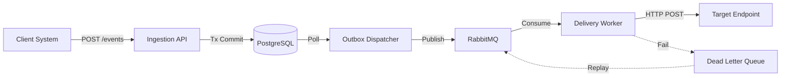

# Webhook Delivery Platform

> Enterprise-grade outbound webhook engine ensuring reliable, asynchronous event delivery with retries, replay capabilities, and comprehensive observability.

## Why This Exists
Building reliable webhooks is deceptively complex. Naive implementations suffer from:
- **Thundering Herds**: Retrying failures without backoff/jitter brings down customer servers.
- **Data Loss**: In-memory queues lose events during restarts.
- **Lack of Visibility**: "Fire and forget" leaves Ops blind to delivery failures.
- **No Isolation**: One slow endpoint clogs the queue for all other tenants.

This platform solves these production challenges with a robust, database-backed architecture designed for scale and correctness.

## Key Features
- **Transactional Outbox**: 100% guarantee that ingested events reach the delivery queue.
- **Smart Retries**: Exponential backoff with jitter to prevent synchronized retry storms.
- **At-Least-Once Delivery**: Robust deduplication handling and delivery guarantees.
- **Dead Letter Queue (DLQ)**: Failed events are captured for manual inspection and replay.
- **Security First**: HMAC-SHA256 signing (Stripe-style) and per-tenant rate limiting.
- **Concurrency Control**: Per-endpoint limits and circuit breakers to protect downstream targets.
- **Observability**: OpenTelemetry tracing and Prometheus metrics built-in.
- **Dual Consoles**: React-based Developer Portal and Angular-based Ops Dashboard.

## Architecture Overview

The system decouples event ingestion from delivery using the Outbox pattern.



### Delivery Semantics
- **Reliability**: At-least-once.
- **Deduplication**: Consumers should use `Webhook-ID` header.
- **Retry Policy**: Configurable max attempts (default: 5) with exponential backoff (2s, 4s, 8s...).

[View detailed Architecture & Design](./docs/ARCHITECTURE.md)

## Tech Stack

### Backend
- **Java 17** / **Spring Boot 3.2.2**
- **PostgreSQL 15** (Primary Store + Outbox)
- **RabbitMQ 3** (Message Broker)
- **Redis 7** (Rate Limiting/Cache)
- **Flyway** (Schema Migrations)
- **Bucket4j 8.1** (Rate Limiting)
- **Testcontainers** (Integration Testing)

### Frontend
- **Developer Portal**: React 19, Vite 7, Material UI 7, DataGrid 8.
- **Ops Console**: Angular 21, Angular Material 21, Standalone Components.

### Observability
- **OpenTelemetry** (Tracing)
- **Micrometer** (Prometheus Metrics)
- **OTEL Collector**

## Repository Structure

```
├── backend/                # Spring Boot Application
│   ├── src/main/java       # Clean Architecture (Domain, App, Adapters, Infra)
│   └── src/test            # E2E Tests with Testcontainers
├── frontend-react/         # Developer Portal (Customer Facing)
│   ├── src/features        # Domain-driven React components
│   └── src/lib             # API clients and utilities
├── frontend-angular/       # Operations Console (Internal)
│   ├── src/app/features    # Admin features (DLQ, Dashboard)
│   └── src/app/core        # Guards, Interceptors
├── infra/                  # Docker Compose & OTEL config
└── docs/                   # Architecture & Project Documentation
```

## Getting Started

### Prerequisites
- Java 17+
- Node.js 20+
- Docker & Docker Compose

### Local Development

1.  **Start Infrastructure**
    ```bash
    cd infra
    docker-compose up -d
    ```
    *Services: Postgres (5432), RabbitMQ (5672/15672), Redis (6379), OTEL (4317/4318)*

2.  **Run Backend**
    ```bash
    cd backend
    ./mvnw spring-boot:run
    ```
    *API: http://localhost:8080*

3.  **Run Developer Portal (React)**
    ```bash
    cd frontend-react
    npm install && npm run dev
    ```
    *URL: http://localhost:5173*

4.  **Run Ops Console (Angular)**
    ```bash
    cd frontend-angular
    npm install && npm start
    ```
    *URL: http://localhost:4200*

### Environment Setup
Copy `.env.example` to `.env` if you need to override defaults. The project comes pre-configured for local development with default ports.

## API & Webhook Contract

### Ingest Event
```bash
curl -X POST http://localhost:8080/events \
  -H "Content-Type: application/json" \
  -d '{
    "eventType": "order.created",
    "payload": { "id": "ord_123", "amount": 9900 }
  }'
```

### Webhook Delivery Headers
Your endpoint will receive POST requests with these headers:

| Header | Description |
|--------|-------------|
| `Webhook-ID` | Unique UUID for the event delivery. |
| `Webhook-Event` | The event type (e.g., `order.created`). |
| `Webhook-Signature` | `t=1709...,v1=hmac_sha256_hash` |

**Verification Example:**
Compute HMAC-SHA256 of `timestamp + "." + raw_body` using your secret key.

## Observability

- **Metrics**: `http://localhost:8080/actuator/prometheus`
- **Health**: `http://localhost:8080/actuator/health`
- **Tracing**: Logs include `traceId` and `spanId` automatically injected by Micrometer Tracing.

## Testing

- **Backend**:
  ```bash
  cd backend
  ./mvnw test  # Runs unit + integration tests via Testcontainers
  ```
- **Frontend**:
  ```bash
  # React
  cd frontend-react && npm run lint && npm run build
  # Angular
  cd frontend-angular && npm run build
  ```

## Roadmap
- [ ] Multi-region active-active deployment support.
- [ ] UI for rotating webhook signing secrets.
- [ ] Advanced retry policies (custom backoff per endpoint).
- [ ] WebSocket integration for real-time delivery logs.
- [ ] Dead-letter analytics and trends.
