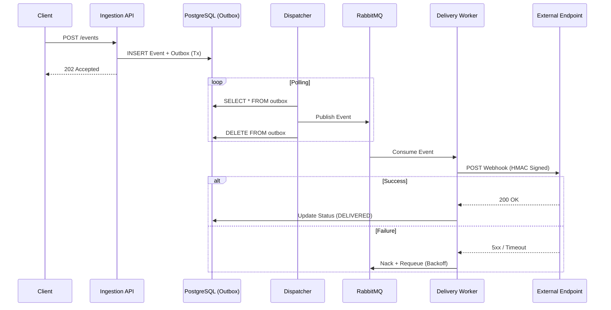

# Architecture & Design

## System Overview

The Webhook Delivery Platform is designed to provide reliable, at-least-once delivery of webhooks to external endpoints. It decouples event ingestion from delivery using the Transactional Outbox pattern and an asynchronous worker queue.

### Core Components

1.  **Ingestion API (REST)**
    - Accepts events from internal systems.
    - Validates payloads (max 1MB).
    - Persists event + outbox entry in a single transaction.

2.  **Transactional Outbox**
    - `outbox_events` table acts as a reliable queue within the database.
    - Guarantees no event is lost even if the message broker is temporarily down during ingestion.

3.  **Dispatcher (Poller)**
    - Periodically polls `outbox_events`.
    - Publishes events to RabbitMQ (`webhook.delivery.exchange`).
    - Deletes/Marks outbox entries upon successful publish.

4.  **Delivery Worker (Consumer)**
    - Consumes messages from RabbitMQ.
    - Executes HTTP POST requests to registered endpoints.
    - Handles retries with exponential backoff.
    - Manages concurrency limits per tenant/endpoint.

5.  **Dead Letter Queue (DLQ)**
    - Events exceeding max retries are moved to a DLQ table/queue.
    - Allows manual inspection and replay via the Ops Console.

## Data Flow

## Delivery Semantics

- **At-Least-Once Delivery**: We guarantee the webhook will be delivered, but in rare network partition scenarios, it might be delivered more than once.
- **Idempotency**: Clients should handle duplicate deliveries using the `Webhook-ID` header.
- **Ordering**: Strict ordering is **not** guaranteed to maximize throughput, though rudimentary sequencing is preserved via the Outbox.

## Security

- **HMAC Signatures**: All outgoing webhooks are signed with HMAC-SHA256 using a shared secret.
- **Rate Limiting**: Token bucket algorithm (Bucket4j) enforces limits per tenant.
- **Circuit Breaker**: Endpoints with high failure rates are temporarily "tripped" to prevent resource exhaustion.
